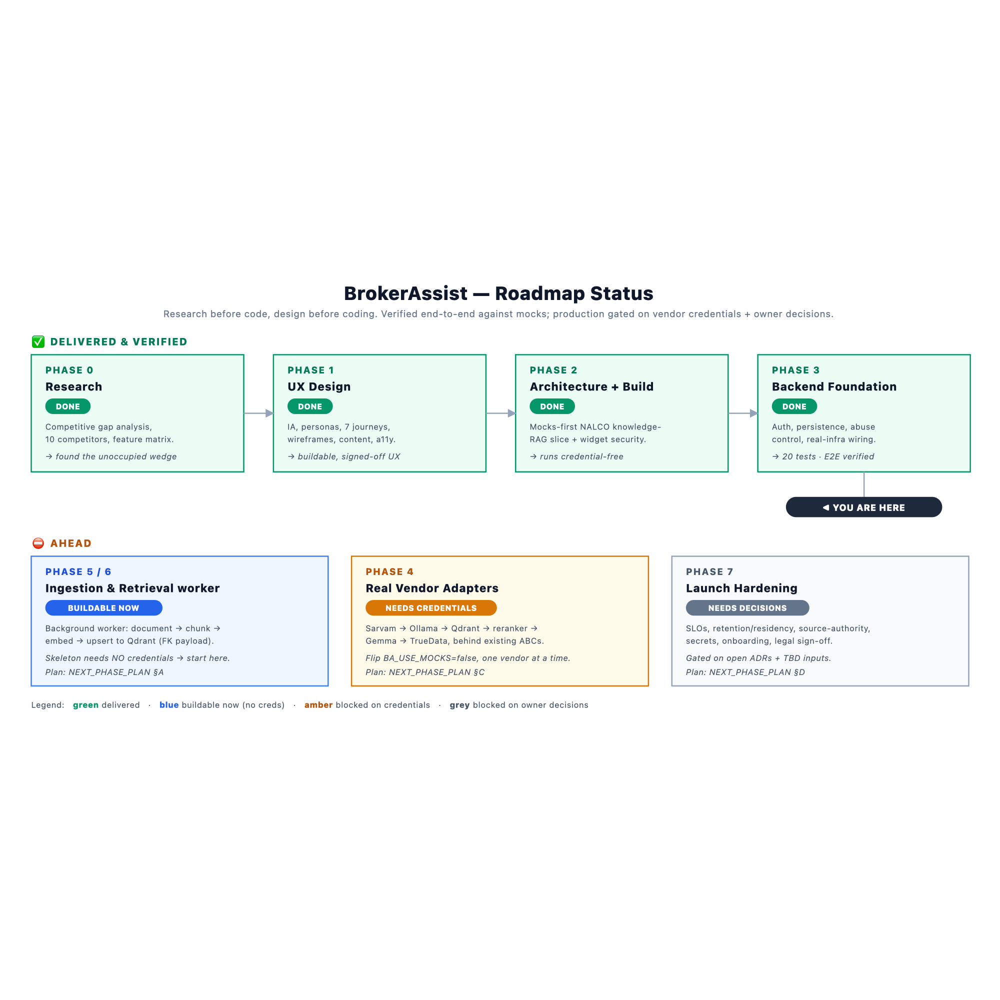
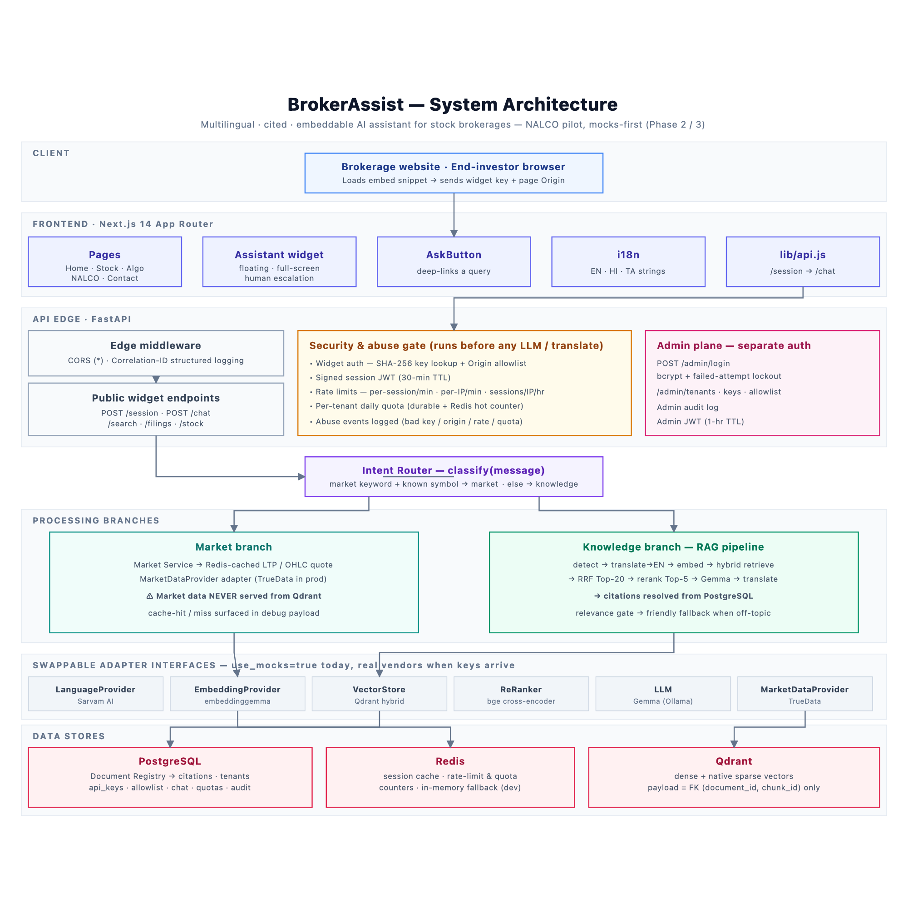
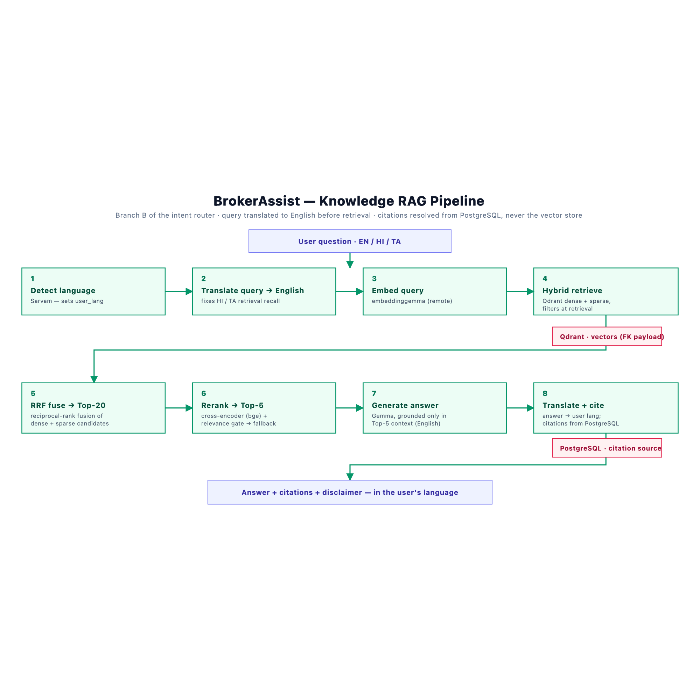
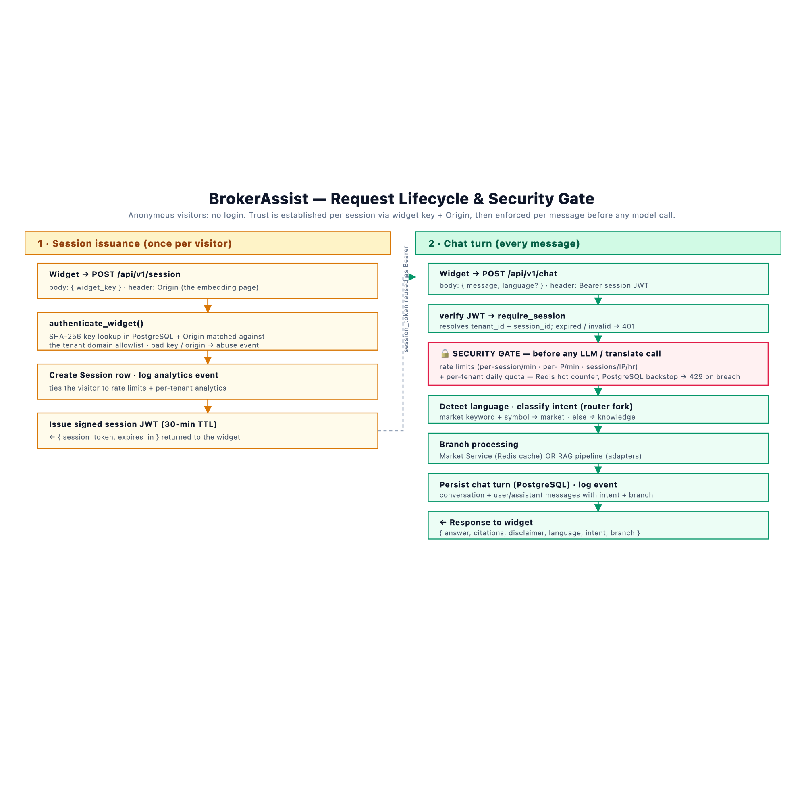
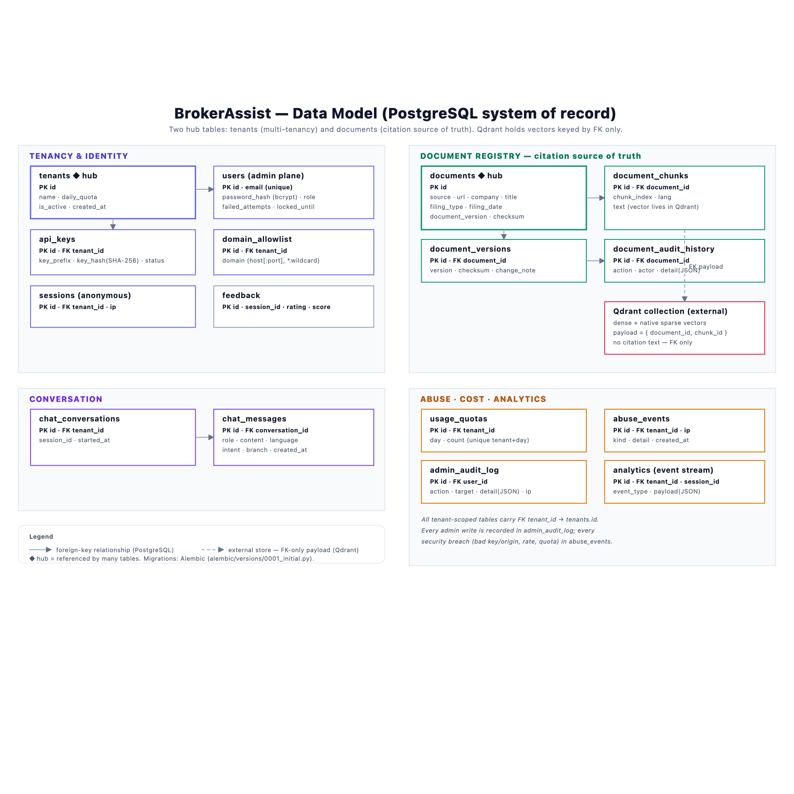

# BrokerAssist — Documentation

Engineering documentation for **BrokerAssist**, the multilingual, cited, embeddable AI assistant for
stock brokerages. The folder is arranged into four areas plus diagrams.

> **AI agent continuing this project?** Read **[CLAUDE.md](CLAUDE.md)** → then
> **[planning/PHASE_STATUS.md](planning/PHASE_STATUS.md)**.

## 🤖 Agent entry point

| File | Purpose |
|---|---|
| [CLAUDE.md](CLAUDE.md) | Orientation for an AI agent — status, invariants, where things live, working agreement |

## 🧭 `planning/` — status & what's next *(read these to plan the next phase)*

| Doc | Purpose |
|---|---|
| [planning/HANDOFF_TO_PHASE_6.md](planning/HANDOFF_TO_PHASE_6.md) | **Start here (latest)** — single entry point: current status + how to structure Phase 6 |
| [planning/HANDOFF_TO_PHASE_5.md](planning/HANDOFF_TO_PHASE_5.md) | Phase 5 handoff guide (historical context) |
| [planning/PHASE_STATUS.md](planning/PHASE_STATUS.md) | **Current state of every phase & capability** (✅/🟡/⛔/⚠️) — the source of truth (roadmap numbering) |
| [planning/PHASE_4_PLAN.md](planning/PHASE_4_PLAN.md) | **Phase 4 — Data Ingestion Layer** — design-approved, ready-to-build plan (not yet implemented) |
| [planning/PHASE_5_KICKOFF.md](planning/PHASE_5_KICKOFF.md) | **Phase 5 — Embedding Pipeline** — kickoff brief (implemented mocks-first) |
| [planning/PHASE_6_KICKOFF.md](planning/PHASE_6_KICKOFF.md) | **Phase 6 — RAG System** — kickoff brief to structure the next phase |
| [planning/NEXT_PHASE_PLAN.md](planning/NEXT_PHASE_PLAN.md) | Workstream catalog (file-level steps, gates, acceptance) — see numbering note inside |
| [planning/DECISIONS_AND_OPEN_ITEMS.md](planning/DECISIONS_AND_OPEN_ITEMS.md) | Settled decisions (incl. Phase-4/5 locked decisions) + open ADRs/inputs that gate production |
| [planning/ROADMAP.md](planning/ROADMAP.md) | Visual phase roadmap with status |

## 📖 `overview/` — understand the project

| Doc | Purpose |
|---|---|
| [overview/PROJECT_JOURNEY.md](overview/PROJECT_JOURNEY.md) | The whole project step by step — every phase, what & how |
| [overview/ARCHITECTURE.md](overview/ARCHITECTURE.md) | How the system works (components, pipeline, lifecycle, stack) — has the diagrams |
| [overview/PROJECT_STRUCTURE.md](overview/PROJECT_STRUCTURE.md) | Repository layout |

## 🔧 `reference/` — build & operate

| Doc | Purpose |
|---|---|
| [reference/SETUP_AND_RUN.md](reference/SETUP_AND_RUN.md) | Run locally (zero creds), config reference, real infra, deploy |
| [reference/API_REFERENCE.md](reference/API_REFERENCE.md) | Every endpoint with auth, request/response, curl |
| [reference/DATA_MODEL.md](reference/DATA_MODEL.md) | All 16 tables, relationships, seed data — with ER diagram |
| [reference/RAG_PIPELINE.md](reference/RAG_PIPELINE.md) | The 8-stage knowledge pipeline deep dive |
| [reference/SECURITY.md](reference/SECURITY.md) | Auth planes, abuse control, admin plane |
| [reference/TESTING.md](reference/TESTING.md) | Test guide + full verification report |

## 🖼️ `diagrams/` — vector (SVG) + raster (PNG)

| Diagram | Shows |
|---|---|
|  | **Roadmap status** — delivered vs ahead, with gates |
|  | **System architecture** — client → frontend → API/security → router → branches → adapters → stores |
|  | **RAG pipeline** — the 8-stage knowledge flow |
|  | **Request lifecycle** — session issuance + per-message security gate |
|  | **Data model** — the 16-table ER map |

## One-paragraph summary

BrokerAssist is a multi-tenant, embeddable widget SaaS that gives a brokerage's website an AI
assistant for stock info, filing explanations, and algo-trading education — in English, Hindi, or
Tamil, always with citations and an "informational only" disclaimer. A FastAPI backend authenticates
each widget by key + Origin, issues a short-lived session token, enforces rate limits and quotas
before any model call, then routes the message to either a Redis-cached market branch or a
retrieval-augmented knowledge pipeline whose citations always resolve from PostgreSQL. Every external
model and vendor sits behind a swappable adapter interface, so the entire system runs **mocks-first**
with zero credentials. Phases 0–3 (research → UX → mocks-first build → hardened backend) are complete
and verified; the remaining work is mostly wiring real vendors behind interfaces that already exist.
