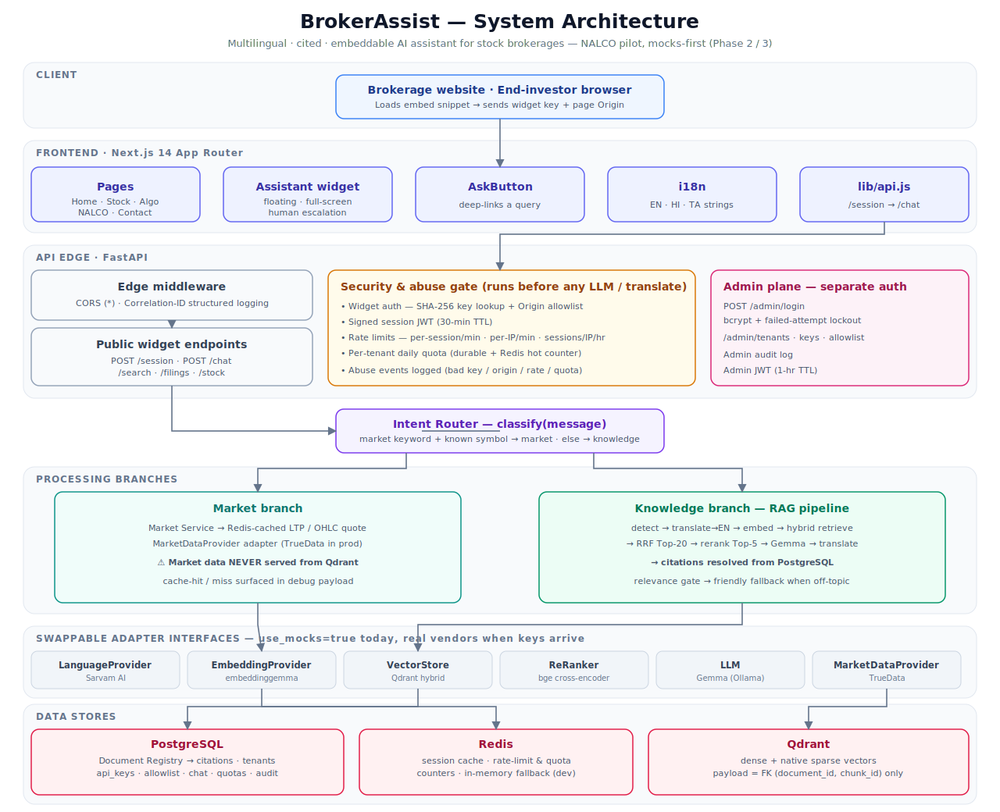
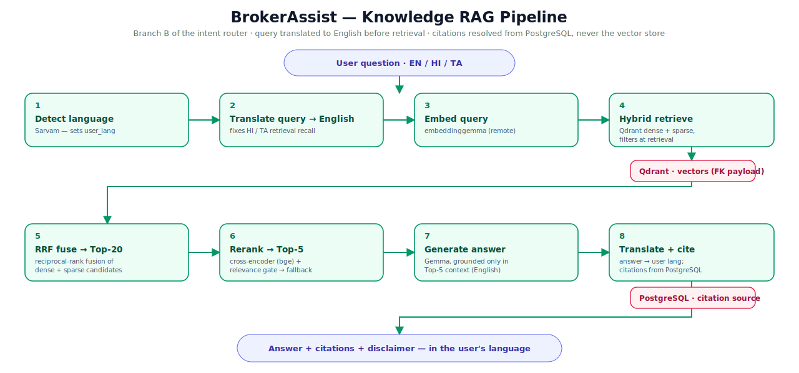
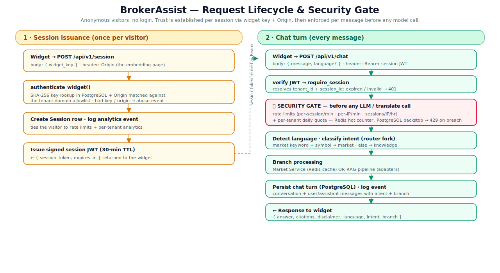

# BrokerAssist — Architecture

> Multilingual, cited, embeddable AI assistant for stock brokerages.
> NALCO knowledge pilot · mocks-first Phase 2 / 3 implementation.

This document explains **what the system is, what has been built, and how it works**. It is the
canonical engineering reference for the application that lives in
[`deliverables/phase_2/brokerassist/`](../../deliverables/phase_2/brokerassist/).

---

## 1. What this is

BrokerAssist is a **B2B SaaS widget**: a brokerage embeds a small snippet on its public website and
gets an AI assistant that answers investor questions about stocks, regulatory filings, and
algo-trading education — **in English, Hindi, or Tamil**, **with citations**, and with a strict
*"informational only, not investment advice"* disclaimer.

| Aspect | Decision |
|---|---|
| Product | Embeddable widget SaaS — multi-tenant (public widget key + domain allowlist) |
| Primary audience | Brokerages (B2B buyers); end-investors are secondary, anonymous users |
| Pilot scope | NALCO knowledge-RAG thin-slice; market-data + ingestion worker stubbed |
| Vendor strategy | **Mocks-first** behind clean adapter interfaces — the whole pipeline runs with zero credentials |
| Languages | English · Hindi · Tamil (query translated to English *before* retrieval) |
| Citations | Always resolved from the **PostgreSQL document registry**, never from the vector store |

The guiding roadmap principle is *"research before code, design before coding"* — hence the phased
deliverables (Phase 0 research → Phase 1 UX → Phase 2/3 build). See
[STATUS.md](../planning/PHASE_STATUS.md) for exactly what is done vs deferred.

---

## 2. Architecture at a glance

*Raster copy: [`diagrams/system-architecture.png`](../diagrams/system-architecture.png)*

The system is a layered request path. A browser loads the widget, which calls a FastAPI backend.
Every request passes a **security gate** before any model is touched. An **intent router** then forks
the request into one of two branches — fast market-data lookups, or the knowledge RAG pipeline. All
external models and vendors sit behind **swappable adapter interfaces** (currently mocked), and state
lives in **PostgreSQL, Redis, and Qdrant**.

---

## 3. Component walkthrough

### 3.1 Frontend — Next.js 14 (App Router)

A direct port of the Phase 1 prototype into Next.js, plus the embeddable assistant widget.

- **Pages:** Home, Stock Research, Algo Education, NALCO, Contact (`apps/frontend/app/*`).
- **`Assistant` widget** — floating / full-screen states with a human-escalation path.
- **`AskButton`** — deep-links a pre-filled query straight into the widget (e.g. *"Explain NALCO
  latest quarterly result"*).
- **`lib/i18n.js`** — EN / HI / TA string tables and a `useLang()` hook.
- **`lib/api.js`** — the only network boundary: it requests a session token, then calls `/chat`.

### 3.2 API edge & security — FastAPI

Defined in `apps/backend/app/main.py` and `app/core/*`.

- **Edge middleware:** permissive CORS (the widget is embedded cross-origin; the real trust boundary
  is the Origin allowlist enforced at `/session`) plus a **Correlation-ID** middleware for structured,
  traceable logs.
- **Security & abuse gate** (`core/security.py`, `core/ratelimit.py`) — runs **before any LLM or
  translation call**:
  - **Widget auth** — the public key is looked up by SHA-256 hash, and the request `Origin` is matched
    against the tenant's domain allowlist (`*.` subdomain wildcards supported).
  - **Signed session JWT** — anonymous visitors get a 30-minute token; no login required.
  - **Rate limits** — per-session/minute, per-IP/minute, and sessions/IP/hour.
  - **Per-tenant daily quota** — a Redis hot counter with a durable PostgreSQL backstop.
  - **Abuse events** — bad key / bad origin / rate / quota breaches are logged for analytics.

### 3.3 Intent router (`services/intent_router.py`)

`classify(message)` is a lightweight, deterministic fork:

- A **market** intent requires both a market keyword (`ltp`, `price`, `quote`, `ohlc`, …) **and** a
  known symbol (NALCO, TCS, INFY, …) → routes to the Market Service.
- Everything else is a **knowledge** intent (with sub-intents `filing_dividend`, `algo_education`,
  `filing_board`, `knowledge_general` for analytics/filtering) → routes to the RAG pipeline.

### 3.4 Market branch (`services/market_service.py`)

Returns last-traded-price / OHLC quotes from a **Redis-cached** `MarketDataProvider` adapter
(TrueData in production). The cache-hit/miss is surfaced in the response debug payload.
**Invariant:** market data is *never* served from the vector store.

### 3.5 Knowledge branch — the RAG pipeline (`services/rag_pipeline.py`)

*Raster copy: [`diagrams/rag-pipeline.png`](../diagrams/rag-pipeline.png)*

The canonical pipeline, stage by stage:

1. **Detect language** (Sarvam) → sets the user's language.
2. **Translate query → English** before retrieval — this is what makes HI/TA recall work.
3. **Embed** the English query (`embeddinggemma`).
4. **Hybrid retrieve** from Qdrant — dense + native sparse, with filters applied *at retrieval*.
5. **RRF fuse** the candidate lists → Top-20.
6. **Cross-encoder rerank** → Top-5, then a **relevance gate**: if nothing meaningfully overlaps the
   query (chit-chat / off-topic) it returns a friendly fallback **with no citations**, rather than
   citing unrelated filings.
7. **Generate** the answer with Gemma, grounded only in the Top-5 context.
8. **Translate back** to the user's language and **resolve citations from PostgreSQL** — the vector
   store holds only foreign keys, so the registry is the single source of citation truth.

Every knowledge answer carries the disclaimer *"Informational only — not investment advice."*

### 3.6 Adapter layer (`adapters/base.py`, `adapters/__init__.py`)

The roadmap mandates that **no model weights run in-process** — every embedding, generation, rerank,
translation, and market call is a remote service behind an abstract interface:

| Interface | Production vendor | Today |
|---|---|---|
| `LanguageProvider` | Sarvam AI | Mock |
| `EmbeddingProvider` | Ollama Cloud · embeddinggemma | Mock |
| `VectorStore` | Qdrant (dense + sparse) | Mock (built from registry chunks) |
| `ReRanker` | Hosted cross-encoder (bge) | Mock |
| `LLM` | Ollama Cloud · Gemma | Mock |
| `MarketDataProvider` | TrueData (primary) | Mock |

Flipping `BA_USE_MOCKS=false` switches the factory to real adapters (each currently raises
`NotImplementedError` until wired with credentials).

### 3.7 Data stores

- **PostgreSQL** — the system of record: document registry (citations), tenancy (`tenants`,
  `api_keys`, `domain_allowlist`), sessions, chat history, quotas, and audit/abuse logs. SQLite is the
  drop-in dev substitute (same SQLAlchemy models).
- **Redis** — session cache and the hot counters for rate-limiting and quotas. Falls back to an
  in-memory implementation in dev when no `BA_REDIS_URL` is set.
- **Qdrant** — dense + native sparse vectors. **Payload holds only `(document_id, chunk_id)` foreign
  keys** — never citation text.

### 3.8 Admin plane (`api/routes_admin.py`, `core/admin_security.py`)

A separate authentication plane for operators: `POST /admin/login` (bcrypt + failed-attempt lockout,
1-hour admin JWT), tenant / key / allowlist management, and an admin audit log. End-investors are
*never* users here — they are anonymous sessions.

---

## 4. Request lifecycle

*Raster copy: [`diagrams/request-lifecycle.png`](../diagrams/request-lifecycle.png)*

**Phase 1 — Session issuance (once per visitor):** the widget posts its `widget_key` with the page
`Origin`; the backend verifies the hashed key + allowlist, records a `Session`, and returns a signed
session JWT.

**Phase 2 — Chat turn (every message):** the token is verified, the **security gate** (rate limits +
daily quota) runs *before any model call*, the intent is classified, the request is handled by the
market or knowledge branch, the turn is persisted, and the response `{ answer, citations, disclaimer,
language, intent, branch }` is returned.

---

## 5. Data model (key tables)

Defined in `apps/backend/app/db/models.py`. Highlights:

- **Tenancy / identity:** `tenants`, `api_keys` (SHA-256 hash + prefix, rotation/revocation),
  `domain_allowlist`, `sessions`, `users` (admin plane).
- **Document registry (citation source of truth):** `documents`, `document_chunks` (vector lives in
  Qdrant; row holds the text + FK), `document_versions` (checksum-based version detection),
  `document_audit_history`.
- **Conversation:** `chat_conversations`, `chat_messages` (role, language, intent, branch).
- **Abuse & cost:** `usage_quotas` (per-tenant/day), `abuse_events`, `admin_audit_log`, plus
  `feedback` and a generic `analytics` event stream.

The schema is managed with **Alembic** (`alembic/versions/0001_initial.py`); dev uses
`create_all()` via the idempotent `seed()` on startup.

---

## 6. Multilingual design

- Supported: **English, Hindi, Tamil** (`BA_SUPPORTED_LANGUAGES`).
- The query is **translated to English before retrieval and reranking**, so the knowledge base can
  stay English-first while serving HI/TA users with good recall.
- The answer is generated in English, then **translated back** to the user's language.
- Off-topic / chit-chat inputs get a localized fallback message in the user's language with no
  fabricated citations.

---

## 7. Technology stack

| Layer | Technology |
|---|---|
| Frontend | Next.js 14 (App Router), React 18 |
| Backend | FastAPI, Pydantic v2, Uvicorn |
| ORM / migrations | SQLAlchemy 2.0, Alembic |
| Auth | PyJWT (sessions + admin), bcrypt (admin passwords) |
| Datastores | PostgreSQL (prod) / SQLite (dev), Redis, Qdrant |
| AI (prod, behind adapters) | Sarvam (language), embeddinggemma, Gemma, bge reranker (Ollama Cloud / hosted) |
| Market data (prod) | TrueData |
| Tests | pytest (20 passing) |
| Infra | Docker Compose (local), Railway (target) |

---

## 8. Configuration & environments

Configuration is centralized in `app/config.py` (env-prefixed `BA_`, `.env` supported).

- **Dev (default):** `BA_USE_MOCKS=true`, SQLite, in-memory Redis fallback, mock AI — runs with **zero
  credentials**. `seed()` creates a demo tenant (widget key `demo-public-key`, allowlist `localhost*`)
  and a superadmin (`admin@brokerassist.local` / `admin12345`).
- **Phase 3 / production infra:** real PostgreSQL + Redis + Qdrant via `docker-compose`, Alembic
  migrations, and `/ready` reporting per-store health. Qdrant connectivity + collection are validated
  on startup (no ingestion/embeddings yet — that is a later workstream).
- **Promote to real vendors:** set `BA_USE_MOCKS=false` and provide `BA_OLLAMA_*`, `BA_SARVAM_API_KEY`,
  `BA_RERANKER_URL`, `BA_QDRANT_URL`, and market-data credentials, then implement the real adapters
  behind `app/adapters/base.py`.

> **Secrets:** never commit a filled `.env`; rotate any key ever shared in plaintext.

---

## 9. Deployment topology

- **Monorepo, multi-service** (frontend + backend), targeting **Railway** (see
  `brokerassist/infra/railway.md`).
- **`docker-compose.yml`** brings up Postgres + Redis + Qdrant + backend locally; the backend stays
  mocks-first for AI until vendor credentials arrive.
- Backend serves on `:8200` (`/docs` for OpenAPI); frontend on `:3000`.

---

## 10. Testing

`apps/backend/tests/` — **20 passing tests**:

- `test_pipeline.py` — intent routing, the RAG branch, multilingual translation, and the
  citations-from-Postgres invariant.
- `test_phase3.py` — widget auth (key + origin), session JWT, rate limits, quotas, and the admin plane.

Run with `pytest -q` from `apps/backend`.

---

## 11. Design principles / invariants

These are load-bearing — preserve them when extending the system:

1. **Citations resolve from PostgreSQL, never from Qdrant.** The vector payload is FK-only.
2. **Market data never comes from the vector store.** It has its own cached branch.
3. **No model weights in-process.** Every model is a remote call behind an adapter.
4. **The security/abuse gate runs before any paid model call.**
5. **Translate the query to English before retrieval** for multilingual recall.
6. **Mocks-first.** Every vendor is swappable; the full pipeline runs credential-free.

---

## 12. Status

See [STATUS.md](../planning/PHASE_STATUS.md) for the implemented-vs-deferred breakdown and the open decisions that
must be settled before production wiring. Repository layout is documented in
[PROJECT_STRUCTURE.md](PROJECT_STRUCTURE.md).
