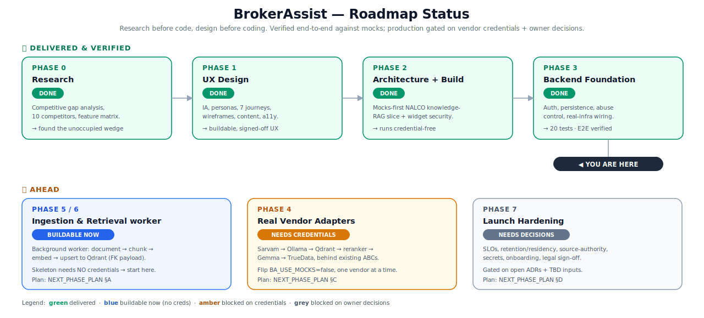

# Roadmap

The phase roadmap at a glance — what's delivered, where we are, and what's ahead. For task-level
status see [PHASE_STATUS.md](PHASE_STATUS.md); for how to execute the next steps see
[NEXT_PHASE_PLAN.md](NEXT_PHASE_PLAN.md).

*Raster copy: [`../diagrams/roadmap-status.png`](../diagrams/roadmap-status.png)*

---

## Delivered & verified ✅

| Phase | Outcome |
|---|---|
| **0 — Research** | Validated the unoccupied market wedge (multilingual + cited + finance-depth + embeddable). |
| **1 — UX design** | Signed-off, buildable UX: IA, personas, 7 journeys, wireframes, widget behavior. |
| **2 — Architecture + build** | A production-shaped, **mocks-first** NALCO knowledge-RAG slice that runs credential-free. |
| **3 — Backend foundation** | Widget auth, session tokens, abuse/cost control, normalized persistence, real-infra wiring, observability. 20 tests + E2E. |

## You are here ▼

The pilot thin-slice is **built and verified end-to-end against mocks.** Production readiness is gated
on **vendor credentials and owner decisions — not on more design or architecture.**

## Ahead ⛔

> **Numbering note (2026-06-24):** corrected to the roadmap. **Phase 4 = Data Ingestion Layer ·
> Phase 5 = Embedding Pipeline · Phase 6 = RAG · Phase 7 = Multilingual.** "Real vendor adapters" is a
> cross-cutting wiring workstream ([NEXT_PHASE_PLAN.md](NEXT_PHASE_PLAN.md) §C), not a roadmap phase.

| Phase | Gate | Start when |
|---|---|---|
| **4 — Data Ingestion Layer** | 🔵 none (fixtures-first) | **Now** — design-approved, ready to implement ([PHASE_4_PLAN.md](PHASE_4_PLAN.md)) |
| **5 — Embedding Pipeline** | ✅ **Done (mocks-first)** | Implemented mocks-first (`services/embedding_pipeline.py`, 31 unit tests passing); live path needs Phase 4 output + Ollama/Qdrant creds. |
| **6 — RAG System** | 🔵 none to structure / 🟠 Phase 5 + vendor keys | **Next** — structure it ([PHASE_6_KICKOFF.md](PHASE_6_KICKOFF.md)) and prepare for live adapter wiring. |
| **Cross-cutting — Real vendor adapters** | 🟠 vendor credentials | A key arrives → wire one adapter ([plan §C](NEXT_PHASE_PLAN.md#workstream-c--real-vendor-adapters-phase-4---needs-credentials-one-vendor-at-a-time)) |
| **Standalone widget package** | 🔵 none | Anytime ([plan §B](NEXT_PHASE_PLAN.md#workstream-b--standalone-embeddable-widget-package--no-credentials-needed)) |
| **Launch hardening** | ⚪ owner decisions | TBDs resolved ([plan §D](NEXT_PHASE_PLAN.md#workstream-d--production-hardening--launch-phase-7---needs-owner-decisions)) |

## Guiding principle

The program intentionally followed **"research before code, design before coding."** That sequencing is
why Phases 0–1 produced no code and Phase 2 built behind clean interfaces: the expensive, hard-to-
reverse work (vendor lock-in, schema, security model) was de-risked first. Keep that discipline — the
remaining phases are mostly **wiring** behind interfaces that already exist, plus decisions that only
the owner can make.
