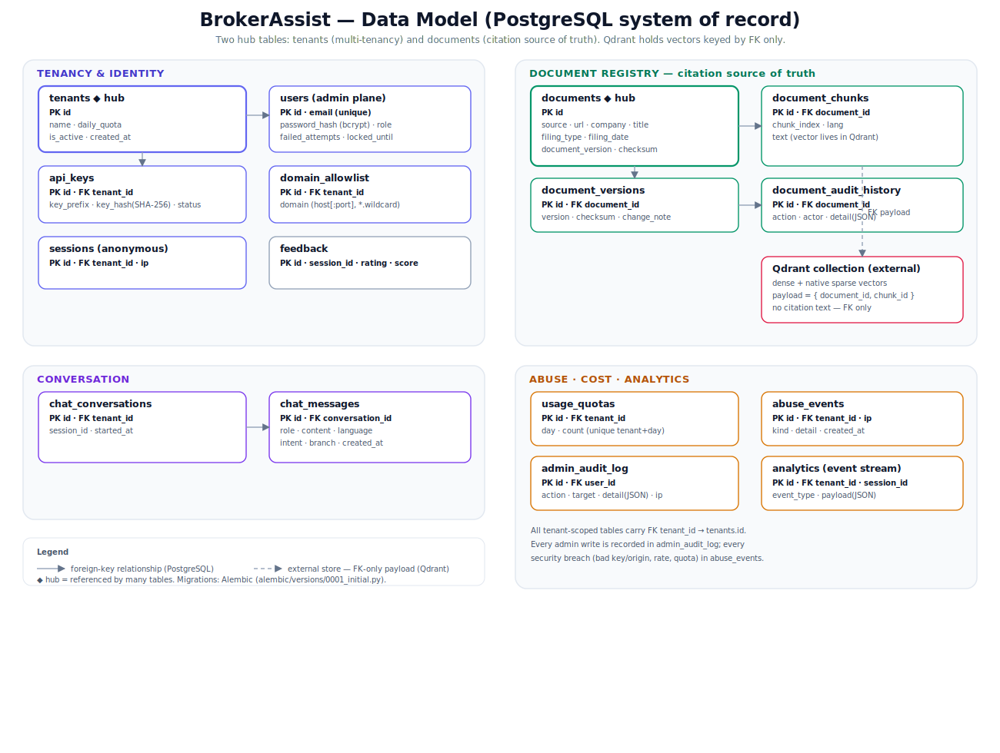

# Data Model

PostgreSQL is the **system of record** (SQLite is the drop-in dev substitute — one SQLAlchemy model
layer, `BA_DATABASE_URL` selects the engine). Schema is defined in
`apps/backend/app/db/models.py` and migrated with Alembic (`alembic/versions/0001_initial.py`).

*Raster copy: [`diagrams/data-model.png`](../diagrams/data-model.png)*

Two **hub tables** anchor everything: **`tenants`** (multi-tenancy) and **`documents`** (the citation
source of truth). The 16 tables group into four domains.

---

## 1. Tenancy & identity

| Table | Key columns | Purpose |
|---|---|---|
| `tenants` | id, name, daily_quota, is_active | A brokerage (the multi-tenant unit) |
| `users` | id, email (unique), password_hash, role, failed_attempts, locked_until | Admin/operator accounts (`admin`/`superadmin`) |
| `api_keys` | id, **FK** tenant_id, key_prefix, key_hash (SHA-256), status | Per-brokerage public widget keys (rotation/revocation) |
| `domain_allowlist` | id, **FK** tenant_id, domain | Allowed `Origin` hosts (exact host[:port] or `*.` wildcard) |
| `sessions` | id, **FK** tenant_id, ip | Anonymous visitor sessions (no login) |

> **End-investors are never `users`.** They are anonymous `sessions` tied to a signed token.

---

## 2. Document registry (citation source of truth)

| Table | Key columns | Purpose |
|---|---|---|
| `documents` | id, source, url, company, filing_type, filing_date, title, document_version, checksum | One registered document; **all citation fields live here** |
| `document_chunks` | id, **FK** document_id, chunk_index, text, lang | A chunk; its **vector lives in Qdrant**, the row keeps the text + FK |
| `document_versions` | id, **FK** document_id, version, checksum, change_note | Checksum-based version history |
| `document_audit_history` | id, **FK** document_id, action, actor, detail (JSON) | Lifecycle audit (`registered`/`reindexed`/`updated`/`deleted`) |

**The core invariant (ADR-002):** Qdrant stores only `(document_id, chunk_id)` in its payload — **no
citation text**. Citations are always resolved by looking up `documents` in PostgreSQL. This means the
vector store can be re-indexed freely without ever touching the citation source of truth.

---

## 3. Conversation

| Table | Key columns | Purpose |
|---|---|---|
| `chat_conversations` | id, **FK** tenant_id, session_id, started_at | A conversation thread per session |
| `chat_messages` | id, **FK** conversation_id, role, content, language, intent, branch | Each user/assistant turn, with routing metadata |

---

## 4. Abuse · cost · analytics

| Table | Key columns | Purpose |
|---|---|---|
| `usage_quotas` | id, **FK** tenant_id, day, count (unique tenant+day) | Durable per-tenant daily counter (Redis holds the hot counter) |
| `abuse_events` | id, **FK** tenant_id, ip, kind, detail | Logged breaches: `rate_limit`/`quota`/`bad_origin`/`bad_key`/`bot` |
| `admin_audit_log` | id, **FK** user_id, action, target, detail (JSON), ip | Every admin write |
| `feedback` | id, session_id, rating, note, score | End-user feedback |
| `analytics` | id, **FK** tenant_id, session_id, event_type, payload (JSON) | Generic event stream (session_created, chat, search, …) |

---

## Relationships at a glance

- `tenants` **1—∗** `api_keys`, `domain_allowlist`, `sessions`, `usage_quotas`, `chat_conversations`,
  `abuse_events`, `analytics`.
- `documents` **1—∗** `document_chunks`, `document_versions`, `document_audit_history`.
- `chat_conversations` **1—∗** `chat_messages`.
- `users` **1—∗** `admin_audit_log`.
- `document_chunks` **1—1** Qdrant vector (external, **FK-only payload**, dashed in the diagram).

---

## Seeded dev data (`db/seed.py`, idempotent)

- **Tenant** "Demo Brokerage" (`daily_quota` 5000) + a second "Acme Securities" (1000).
- **Widget key** `demo-public-key`; **allowlist** `localhost`, `127.0.0.1`, `localhost:3000`,
  `localhost:8123`.
- **Superadmin** `admin@brokerassist.local` / `admin12345` (override `BA_ADMIN_SEED_PASSWORD`).
- **Knowledge base** — 4 documents, each with a chunk + a version + an audit row:
  1. NALCO Q4 FY25 Financial Results (`NALCO_IR`)
  2. NALCO Board Meeting Outcome (`NSE`)
  3. NALCO Dividend History (`NALCO_IR`)
  4. NSE retail algo: white-box vs black-box (`ALGO`)

## Dev vs production

| | Dev | Production |
|---|---|---|
| Engine | SQLite (`brokerassist.db`) | PostgreSQL (`BA_DATABASE_URL`) |
| Schema creation | `seed()` → `create_all()` on startup | `alembic upgrade head` |
| Counters | in-memory Redis fallback | real Redis |
| Vectors | mock store built from chunks | Qdrant (dense + native sparse) |
